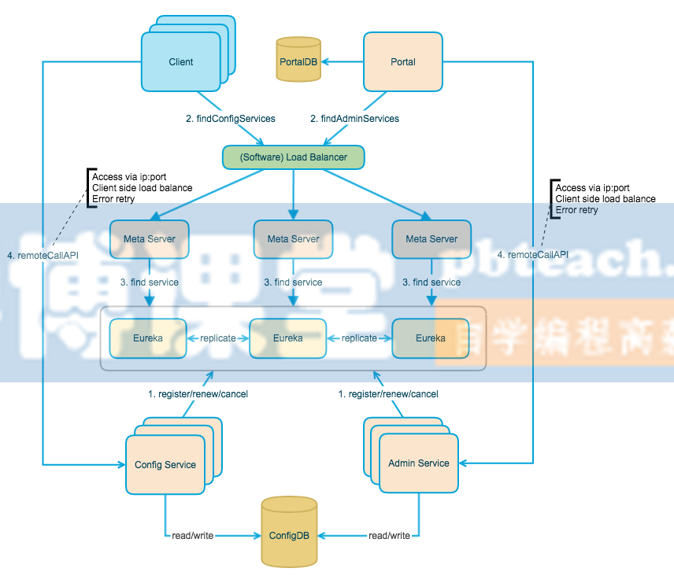

# 工程简介

学习视频
https://www.bilibili.com/video/BV1eE41187sS?p=19

PDF
http://www.pbteach.com/java/java_05_03/20210527/582534840956485632.html

Apollo结构

Config Service提供配置的读取、推送等功能，服务对象是Apollo客户端

Admin Service提供配置的修改、发布等功能，服务对象是Apollo Portal（管理界面）

Eureka提供服务注册和发现，为了简单起见，目前Eureka在部署时和Config Service是在一个JVM进程中的

Config Service和Admin Service都是多实例、无状态部署，所以需要将自己注册到Eureka中并保持心跳

在Eureka之上架了一层Meta Server用于封装Eureka的服务发现接口

Client通过域名访问Meta Server获取Config Service服务列表（IP+Port），而后直接通过IP+Port访问服务，同时在Client侧会做load balance、错误重试

Portal通过域名访问Meta Server获取Admin Service服务列表（IP+Port），而后直接通过IP+Port访问服务，同时在Portal侧会做load balance、错误重试